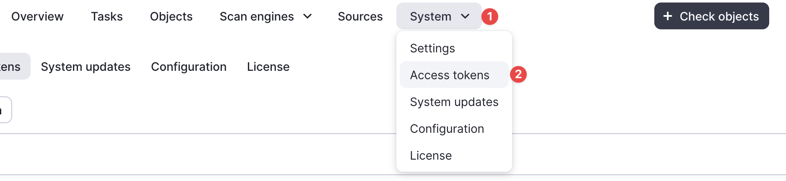

## Get Public API token

!!! info "Info"

    If you do not have direct access to the sandbox interface, it is better to request access through your supervisor.

- Open the Access Tokens tab in the interface.



- Click on `Create access token` and fill in the parameters using the example from the screenshot.


- Now you can copy this token and save it to a config file.


## Create config file

The details are described in [Configuration](../configuration.md)

## Help

<!-- termynal -->

```sh
$ sandbox-cli --help

Usage: sandbox-cli COMMAND

Work with sandbox like a pro

╭─ Commands ────────────────────────────────────────────────────────────────╮
│ conv unpack  Convert sandbox logs into an analysis-friendly format.       │
│ download     Download any artifact from the sandbox.                      │
│ email        Send an email and get its headers                            │
│ images       Get available images in the sandbox.                         │
│ report       Generate short report from sandbox scans.                    │
│ rules        Working with raw sandbox rules                               │
│ scanner      Scan with the sandbox.                                       │
│ --help -h    Display this message and exit.                               │
│ --version    Display application version.                                 │
╰───────────────────────────────────────────────────────────────────────────╯
```

!!! tip "Tip"

    It looks much better in the terminal :smile:
